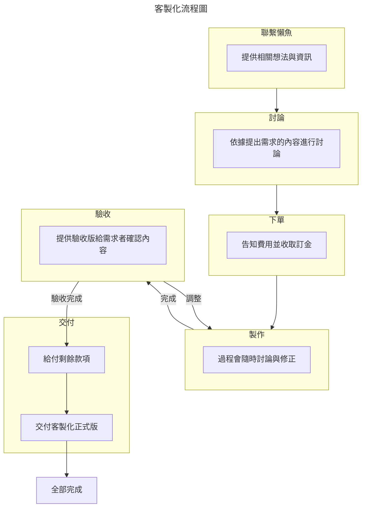

# 客製化

針對個人需求的「客製化」。調整 or 再次提升功能性 ( 依個人想法新增功能 )

範例在下面，開放預覽

## 客製化流程

## 客製化案例

案例目錄
- [跨市場總覽(同步多個股票管理表)](客製化.md#跨市場總覽)
- [台股權證版](客製化.md#台股權證版)
- [美股客製版](客製化.md#美股客製版)
- [港股版](客製化.md#港股版)
- [歐股版](客製化.md#歐股版)

### 跨市場總覽
  
  - [預覽連結](https://docs.google.com/spreadsheets/d/1IQi4lzuMhBs-crrWWCkOKGOziw5QHLoJHXu9T84U6kY)

  ::: center
  可同步多個股票管理表，統一瀏覽和查詢
  :::
  

  1. 總覽：跨試算表取得連動，可將另外 3 個股票管理表的資料同步到本試算表內並自動整理＆計算。
  2. 儀表板：可切換 ( `美股` + `港股` + `歐股` ) 直接觀看
  3. 將各市場的市值佔比做整體計算
  4. 交易紀錄：將( `美股` + `港股` + `歐股` ) 的交易紀錄統整進一起 ( 同步連動 )
  ::: tip 有含簡易教學
  因為需要指定跟哪一個股票管理表做資料連動，因此購買此範本需要簡易教學 → Google 遠端會議
  :::

### 台股權證版

  - [預覽連結](https://docs.google.com/spreadsheets/d/1uIzjgipsAJl9ZEB5jUdOiloLhx0bZAXobWcNnhS5vok)
  - 說明
    - 權證代號變更很快，且有期限。
    - 原本的股票代號 <Badge type="danger">不可以</Badge> 新增權證代號
      - 參考 [分頁 > 股票代號](../sheets/股票代號.md)
    - 因需求而客製化了「權證版」
  - 使用方式
    - 在「權證分頁」可輸入權證代號及其中文名稱
    - 新增好權證代號後，在「交易紀錄」即可直接key權證代號。會自動帶出中文和現價
    - 現價 > 必須手動輸入 ( 一個代號，需一次/每日 )
    💡 因權證找不到可以爬蟲的取價網站，所以只能手動輸入。若能提供可改成自動取價
    > 目前嘗試許多網站都無法取得權證現價，可取得網站之條件:
    > 1. 網址後面必須要有權證代號(以便查詢個別權證現價)
    > 2. 必須要是靜態網站

### 美股客製版

  - [預覽連結](https://docs.google.com/spreadsheets/d/16Ygy_nbilindLc0bmEbKoblAAUCyJlonHCTvbh1_exw)
  - 客製化內容
    - 加入每一筆交易的匯率並自動換算成台幣
    - 提供換匯分頁，方便記錄與記帳

### 港股版

  - [預覽連結](https://docs.google.com/spreadsheets/d/1CbcYsptitfv0QHnUEnf_iPCZefv17xEEM1rCYkoSZOY/edit?usp=sharing)
  - 客製化內容
    1. 加入港股指數-恆大.國企
    2. 股票代號改成港股版
    3. 取得限價 - 抓取港股股票價錢(港元)
    4. 增加觀察股票的分頁

### 歐股版

  - [預覽連結](https://docs.google.com/spreadsheets/d/1i8iHfY1dR44tHlM4COFP-rURwwMLaDZhGZUAPS3NFZ0/edit?usp=sharing)
  - 客製化內容
    1. 股票代號改成歐股版
    2. 取得限價 - 抓取歐股股票價錢(歐元)
    3. 增加觀察股票的分頁

